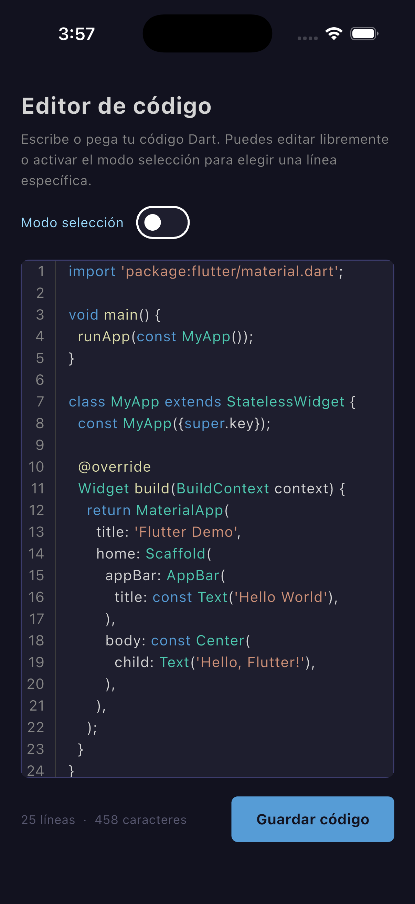
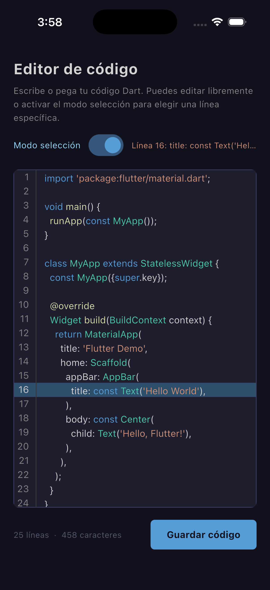
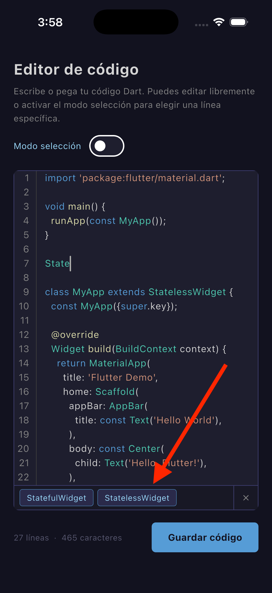

# lite_code_editor

A lightweight, customizable code editor widget for Flutter with syntax highlighting,
auto-indent, autocomplete, and line selection — zero external dependencies.

[](https://pub.dev/packages/lite_code_editor)
[](LICENSE)
[](https://flutter.dev)

---

## Preview

| Editing mode | Selection mode | Autocomplete |
|:---:|:---:|:---:|
|  |  |  |
---

## Features

- **Dart/Flutter syntax highlighting** — keywords, types, strings with
  interpolation, comments, DartDoc, annotations, numbers, class names,
  and function names, all colored in real time as you type
- **Auto-indent** — pressing Enter automatically preserves the indentation
  level of the current line
- **Autocomplete bar** — a horizontal scrollable chip bar appears at the
  bottom of the editor with filtered suggestions as you type, including
  built-in Dart keywords and your own custom keywords
- **Line selection mode** — switch the editor into a read-only mode where
  tapping any line highlights it and returns its index and content
- **Synchronized scroll** — the line number gutter stays perfectly in sync
  with the code area at all times
- **Horizontal scroll** — long lines never wrap; they scroll laterally
- **Dark & Light themes** — a VS Code Dark+ inspired dark theme and a
  clean light theme, both fully customizable down to every color token
- **Zero external dependencies** — 100% Flutter, no third-party packages

---

## Getting started

Add `lite_code_editor` to your `pubspec.yaml`:

```yaml
dependencies:
  lite_code_editor: ^0.1.0
```

Then run:

```bash
flutter pub get
```

---

## Basic usage

```dart
import 'package:lite_code_editor/lite_code_editor.dart';

class MyPage extends StatefulWidget {
  const MyPage({super.key});

  @override
  State<MyPage> createState() => _MyPageState();
}

class _MyPageState extends State<MyPage> {
  late final CodeEditorController _controller;

  @override
  void initState() {
    super.initState();
    _controller = CodeEditorController(
      language: CodeLanguage.dart,
      initialCode: 'void main() {\n  print("Hello!");\n}',
    );
  }

  @override
  void dispose() {
    _controller.dispose();
    super.dispose();
  }

  @override
  Widget build(BuildContext context) {
    return Scaffold(
      body: CodeEditor(
        controller: _controller,
        theme: EditorTheme.dark(),
        onChanged: (code) => print(code),
      ),
    );
  }
}
```

---

## API reference

### CodeEditor

The main widget. Drop it anywhere in your widget tree.

| Parameter | Type | Default | Description |
|---|---|---|---|
| `controller` | `CodeEditorController` | required | Manages code content, language, and selection state |
| `theme` | `EditorTheme?` | `EditorTheme.dark()` | Visual theme for colors and typography |
| `readOnly` | `bool` | `false` | Disables all editing |
| `selectionMode` | `bool` | `false` | Enables line-tap selection mode |
| `customKeywords` | `List<String>` | `[]` | Additional keywords injected into the autocomplete engine |
| `onChanged` | `ValueChanged<String>?` | `null` | Called every time the code changes |
| `onLineSelected` | `void Function(int, String)?` | `null` | Called when a line is tapped in selection mode — receives the 0-based index and the raw line content |

---

### CodeEditorController

Extends Flutter's `TextEditingController`, so it works natively with
the Flutter text system.

```dart
final controller = CodeEditorController(
  initialCode: 'void main() {}',
  language: CodeLanguage.dart,
);

// Read the current code
final code = controller.code;

// Replace all code programmatically
controller.code = 'void main() { print("replaced"); }';

// Change the active language at runtime
controller.language = CodeLanguage.dart;

// Select a line programmatically (0-based index)
controller.selectLine(3);

// Deselect
controller.selectLine(null);

// Read selection state
final index   = controller.selectedLine;        // int?
final content = controller.selectedLineContent; // String?

// Always dispose
controller.dispose();
```

---

### EditorTheme

```dart
// Built-in themes
EditorTheme.dark()   // VS Code Dark+ inspired
EditorTheme.light()  // Clean light theme

// Fully custom theme — every token is configurable
const myTheme = EditorTheme(
  background:              Color(0xFF1E1E2E),
  gutterBackground:        Color(0xFF1E1E2E),
  gutterBorder:            Color(0xFF3C3C3C),
  textColor:               Color(0xFFD4D4D4),
  gutterTextColor:         Color(0xFF858585),
  gutterTextColorActive:   Color(0xFFCCCCCC),
  lineSelectedBackground:  Color(0xFF2D4F6C),
  lineHighlightBackground: Color(0xFF2A2A2A),
  cursorColor:             Color(0xFFAEAFAD),
  selectionColor:          Color(0x664D9AFF),
  fontFamily:              'monospace',
  fontSize:                14,
  lineHeight:              1.5,
);
```

---

## Examples

### Read-only code display

Use the editor as a syntax-highlighted code viewer.

```dart
CodeEditor(
  controller: CodeEditorController(
    initialCode: sourceCode,
    language: CodeLanguage.dart,
  ),
  readOnly: true,
  theme: EditorTheme.dark(),
);
```

### Line selection mode

Let the user pick a specific line from a code block.

```dart
CodeEditor(
  controller: controller,
  selectionMode: true,
  onLineSelected: (int lineIndex, String lineContent) {
    print('Selected line $lineIndex: $lineContent');
  },
);
```

### Custom autocomplete keywords

Inject your own project-specific identifiers into the autocomplete engine.

```dart
CodeEditor(
  controller: controller,
  customKeywords: const [
    'MyWidget',
    'MyService',
    'fetchData',
    'AppColors',
    'AppTheme',
    'AppRouter',
  ],
);
```

### Switch theme at runtime

```dart
bool isDark = true;

CodeEditor(
  controller: controller,
  theme: isDark ? EditorTheme.dark() : EditorTheme.light(),
);
```

### Embedded in a screen with controls

```dart
Column(
  children: [
    const Text('Edit your snippet'),
    Expanded(
      child: CodeEditor(
        controller: controller,
        theme: EditorTheme.dark(),
        onChanged: (code) => setState(() {}),
      ),
    ),
    ElevatedButton(
      onPressed: () => submit(controller.code),
      child: const Text('Submit'),
    ),
  ],
);
```

---

## Roadmap

The following features are planned for upcoming releases.

- [ ] Python, JavaScript / TypeScript, and SQL syntax highlighting
- [ ] Bracket matching for `{}` `()` `[]`
- [ ] Find & replace panel
- [ ] Cursor line highlight in edit mode
- [ ] Custom font family support
- [ ] Minimap

Community contributions are welcome — see [Contributing](#contributing).

---

## Contributing

Pull requests are welcome. For major changes please open an issue first
to discuss what you would like to change.

1. Fork the repository
2. Create your feature branch: `git checkout -b feature/my-feature`
3. Commit your changes: `git commit -m 'Add my feature'`
4. Push to the branch: `git push origin feature/my-feature`
5. Open a Pull Request

---

## License

[MIT](LICENSE) © 2025 Dolph Hincapie